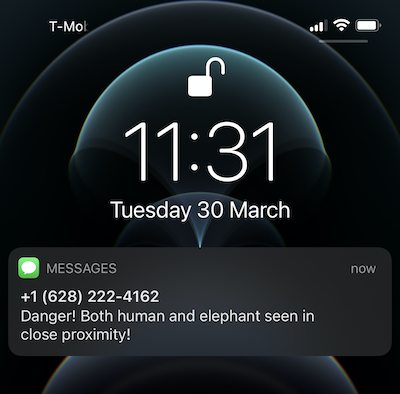

# Twilio example for Edge Impulse for Linux

This is an example application that runs an object detection model using Edge Impulse for Linux and alerts you when two objects are seen together (e.g. an elephant and a person). It's based on the webserver example in the Node.js SDK so you have a clear view of what's happening in front of the camera.

To run this example:

1. Get a [development board](https://docs.edgeimpulse.com/docs/raspberry-pi-4) that supports Edge Impulse for Linux, and follow the setup instructions.
1. Train an [object detection model](#) using Edge Impulse and download it to your device via:

    ```
    $ edge-impulse-linux-runner --download twilio-example.eim
    ```

1. Install [Node.js](https://nodejs.org/en/) v12 or higher.
1. Clone this repository:

    ```
    $ git clone https://github.com/edgeimpulse/example-linux-with-twilio
    ```

1. Install the dependencies:

    ```
    $ npm install
    ```

1. Set your Twilio account token, secret key, the 'from' and 'to' numbers via:

    ```
    $ export TWILIO_AUTH_TOKEN=3ce...
    $ export TWILIO_ACCOUNT_SID=AC305...
    $ export TWILIO_FROM=+162...
    $ export TWILIO_TO=+31624...
    ```

    **Note:** You can add the lines above to your `~/.bashrc` file so they're loaded automatically.

1. In [webserver-twilio.ts](webserver-twilio.ts) set the objects you want to detect (see the `if (bb.find(x => x.label === 'elephant') && bb.find(x => x.label === 'person')) {`) line.
1. Start the application via:

    ```
    $ npm run build
    $ node build/webserver-twilio.js twilio-example.eim
    ```

1. Open a web browser at [http://localhost:4911](http://localhost:4911) to see the webcam image, and keep a close eye to your phone to see the alerts come in!

 
